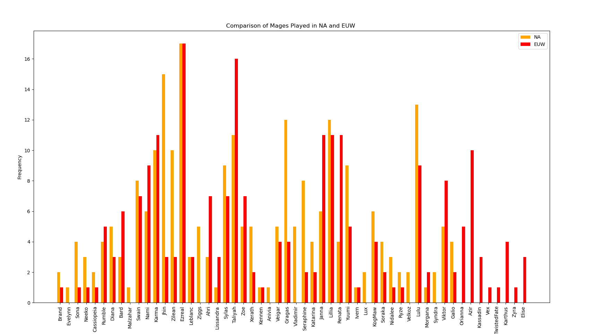

Purpose of project is to compare the mage champions used by players in two different regions.
NA and EUW are used as examples in code.

This work uses Riot-Watcher (https://github.com/pseudonym117/Riot-Watcher) as its API wrapper. 

Data used:

-Top 12 ranked solo players from NA and EUW

-Any mage champions that appeared in each players' last 5 games ( a total of 60 games from each region)

Issues:

-Due to API limitations, the sample size of the data is small hence results may be highly variable and biased.

-As data were only retreived from high ELO matches, the data(selected champions) is skewed.

Instructions:

-Please enter your Riot Development API Key before running code. 
https://developer.riotgames.com/

-my_region,player_region,and player_routing can be changed to compare data of other regions.

-num_matches_data=5 can be edited to change the number of each players' past game.

-Keyword "Mage" in get_Mage() and get_Mage2() can be swapped to "Tank", "Assassin" or other classes to view different comparisons.

